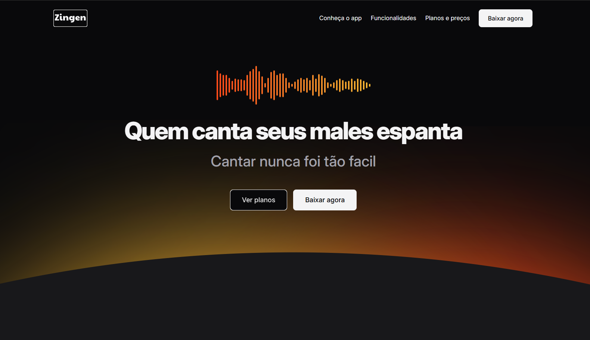
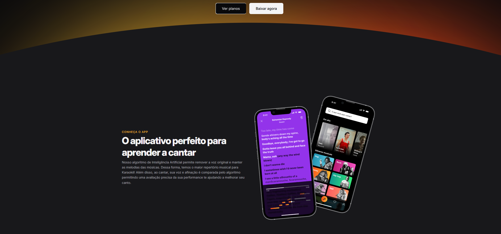
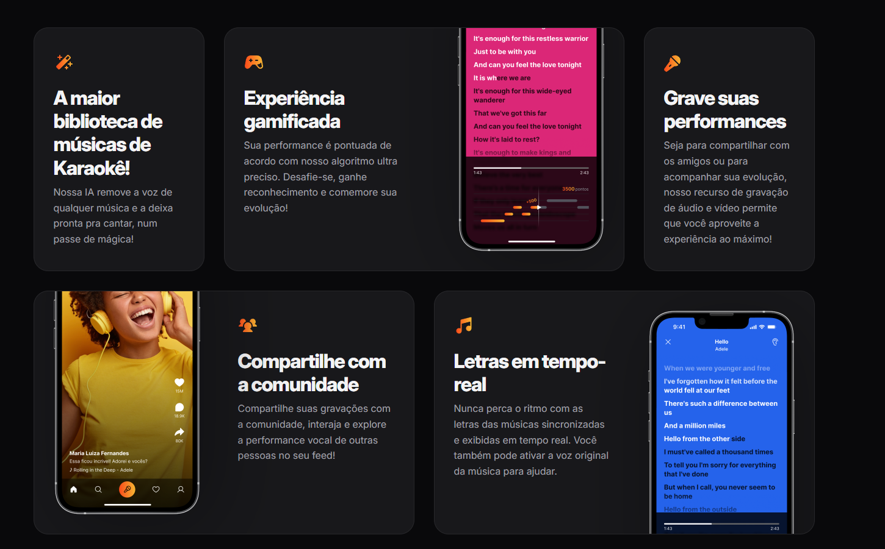
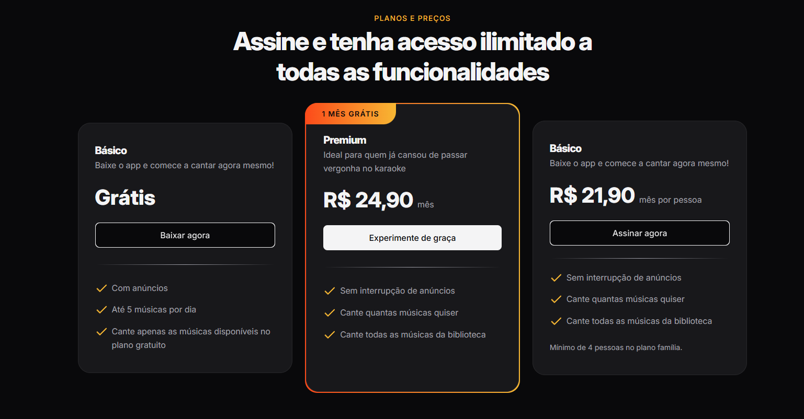
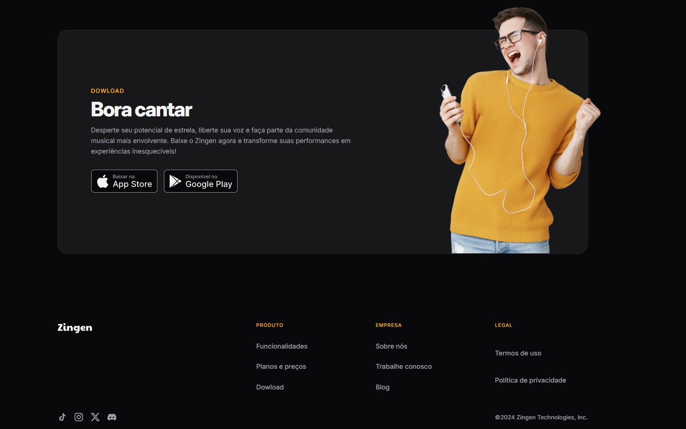
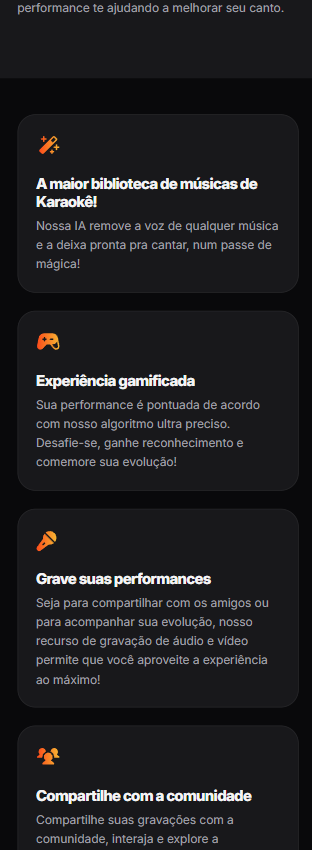
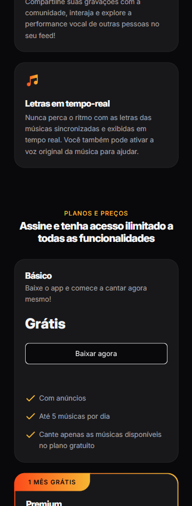
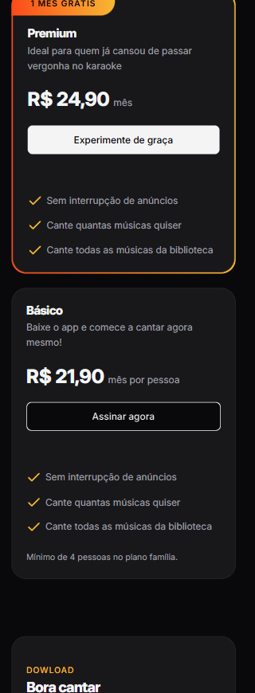
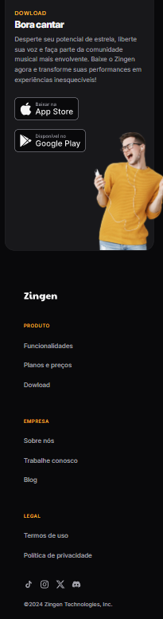

<h1 align="center" style="font-weight: bold;">Escola do Amanhã - Matricula💻</h1>

 <a href="#tech">Technologies</a> • 
 <a href="#started">Getting Started</a> • 

    <b>
      Landing page karaoke app fully responsive, having images on the web and not on mobile using grid, full operation on all screens, using mobile-first in order to attract customers.

     <a href="">📱 Visit this Project</a>

<h2 id="layout">🎨 Layout Web</h2>

      
      
      
      
      

<h2 id="layout">🎨 Layout Mobile</h2>

      
      
      
      
      

<h2 id="tech">💻 Technologies</h2>

- HTML5
- CSS3

<h2 id="started">🚀 Getting started</h2>

- Just download the project with its assets and run it with liveserve or just by opening the html document

